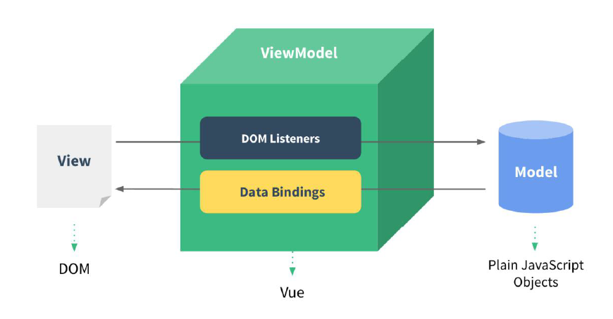
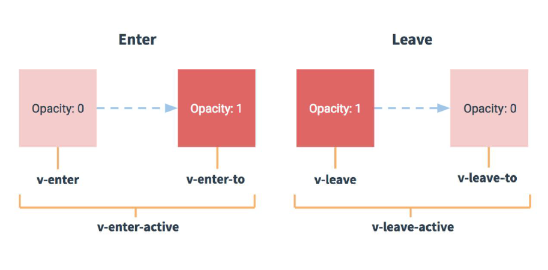
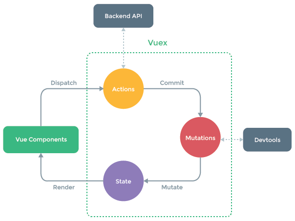

<center>
    <h1>
        Vue基础
    </h1>
</center>

## Vue核心

### 模板语法

**模板的理解**

HTML中包含了一些JS语法代码，语法分别为：

- 插值语法(双大括号表达式)
- 指令(以v-开头)

**插值语法**

1. 功能：用于解析标签体内容
2. 语法：{{xxx}}，xxxx 会作为js表达式解析

**指令语法**

1. 功能：解析标签属性、解析标签体内容、绑定事件
2. 举例：v-bind:href = 'xxxx'，xxxx会作为js表达式被解析

### 数据绑定

**单向数据绑定**

- 语法：v-bind:href ="xxx"或简写为:href
- 特点：数据只能从data 流向页面

**双向数据绑定**

- 语法：v-mode:value="xxx"或简写为v-model="xxx"
- 特点：数据不仅能从data 流向页面，还能从页面流向data

### MVVM模型

1. M：模型(Model)：对应data中的数据
2. V：视图(View)：模板
3. VM：视图模型(ViewModel)：Vue实例对象



### 事件处理

**绑定监听**

- v-on:xxx="fun"
- @xxx="fun"
- @xxx="fun(参数)"
- 默认事件形参：event
- 隐含属性对象：$event

**事件修饰符**

- prevent：阻止默认事件(常用)
- stop：阻止事件冒泡(常用)
- once：事件只触发一次(常用)
- capture：使用事件的捕获模式
- self：只有event.target是当前操作的元素时才触发事件
- passive：事件的默认行为立即执行，无需等待事件回调执行完毕

**按键修饰符**

- keyCode：操作的是某个keyCode值的键
- keyName(key)：操作的某个按键名的键(少部分)

### 计算属性与监视

**计算属性-computed**

- 要显示的数据不存在，要通过计算得来
- 在computed对象中定义计算属性
- 在页面中使用{{方法名}}来显示计算的结果

**监视属性-watch**

- 通过vm对象的$watch()或watch配置来监视指定的属性
- 当属性变化时，回调函数自动调用，在函数内部进行计算

**computed和watch之间的区别**

1. computed能完成的功能，watch都可以完成
2. watch能完成的功能，computed不一定能完成，例如：watch可以进行异步操作

**两个重要的小原则**

1. 所被Vue管理的函数，最好写成普通函数，这样this的指向才是vm或组件实例对象
2. 所有不被Vue所管理的函数(定时器的回调函数、ajax的回调函数等)，最好写成箭头函数，这样this的指向才是vm或组件实例对象

### class与style绑定

**理解**

1. 在应用界面中，某个(些)元素的样式是变化的
2. class/style绑定就是专门用来实现动态样式效果的技术

**class绑定**

- :class='xxx'
- 表达式是字符串：'classA'
- 表达式是对象：{classA: isA, classB: isB}
- 表达式是数组：['classA', 'classB']

**style绑定**

- :style="{ color: activeColor, fontSize: fontSize + 'px' }"
- 其中activeColor/fontSize是data属性

### 条件渲染

**条件渲染指令**

- v-if与v-else
- v-show

**比较v-if与v-show**

- 如果需要频繁切换v-show较好
- 当条件不成立时，v-if的所有子节点不会解析(项目中使用)

### 列表渲染

**列表显示指令**

- 遍历数组：v-for / index
- 遍历对象：v-for / key

```html
<!DOCTYPE html>
<html lang="en">
<head>
    <meta charset="UTF-8">
    <title>列表过滤</title>
    <script type="text/javascript" src="../js/vue.js"></script>
</head>
<body>
    <div id="root">
        <h2>人员列表</h2>
        <input type="text" placeholder="请输入名字" v-model="keyWord">
        <ul>
            <li v-for="(p,index) in filPerons" :key="p.id">
                {{p.name}}-{{p.age}}-{{p.sex}}
            </li>
        </ul>
    </div>
</body>
<script type="text/javascript">
    Vue.config.productionTip = false

    //用watch实现
    /* const vm = new Vue({
        el: '#root',
        data: {
            keyWord: '',
            persons: [
                {id: '001',name: '马冬梅',age: 19,sex: '女'},
                {id: '002',name: '周冬雨',age: 20,sex: '女'},
                {id: '003',name: '周杰伦',age: 21,sex: '男'},
                {id: '004',name: '温兆伦',age: 22,sex: '男'},
            ],
            filPerons: []
        },
        watch: {
            keyWord: {
                immediate: true,
                handler(val){
                    this.filPerons = this.persons.filter((p)=>{
                        return p.name.indexOf(val) !== -1
                    })
                }
            }
        }
        
    }) */

    //用computed实现
    const vm = new Vue({
        el: '#root',
        data: {
            keyWord: '',
            persons: [
                {id: '001',name: '马冬梅',age: 19,sex: '女'},
                {id: '002',name: '周冬雨',age: 20,sex: '女'},
                {id: '003',name: '周杰伦',age: 21,sex: '男'},
                {id: '004',name: '温兆伦',age: 22,sex: '男'},
            ]
        },
        computed: {
            filPerons(){
                return this.persons.filter((p)=>{
                    return p.name.indexOf(this.keyWord) !== -1
                })
            }
        }
    })
</script>
</html>
```

列表升级版，增加排序

```html
<!DOCTYPE html>
<html lang="en">
<head>
    <meta charset="UTF-8">
    <title>列表排序</title>
    <script type="text/javascript" src="../js/vue.js"></script>
</head>
<body>
    <div id="root">
        <h2>人员列表</h2>
        <input type="text" placeholder="请输入名字" v-model="keyWord">
        <button @click="sortType = 2">年龄升序</button>
        <button @click="sortType = 1">年龄降序</button>
        <button @click="sortType = 0">原顺序</button>
        <ul>
            <li v-for="(p,index) in filPerons" :key="p.id">
                {{p.name}}-{{p.age}}-{{p.sex}}
            </li>
        </ul>
    </div>
</body>
<script type="text/javascript">
    Vue.config.productionTip = false

    //用computed实现
    const vm = new Vue({
        el: '#root',
        data: {
            keyWord: '',
            sortType: 0, //0原顺序 1降序 2升序
            persons: [
                {id: '001',name: '马冬梅',age: 30,sex: '女'},
                {id: '002',name: '周冬雨',age: 31,sex: '女'},
                {id: '003',name: '周杰伦',age: 18,sex: '男'},
                {id: '004',name: '温兆伦',age: 19,sex: '男'},
            ]
        },
        computed: {
            filPerons(){
                const arr = this.persons.filter((p)=>{
                    return p.name.indexOf(this.keyWord) !== -1
                })
                if (this.sortType) {
                    arr.sort((p1,p2)=>{
                        return this.sortType === 1 ? p2.age - p1.age : p1.age - p2.age
                    })
                }
                return arr
            }
        }
    })
</script>
</html>
```

**Vue监视数据的原理**

1. vue会监视data中所有层次的数据
2. 如何检测对象中的数据？
   - 通过setter实现监视，且要在new Vue是就传入要监测的数据
   - 对象中后追加的属性，Vue默认不做响应式处理
   - 如需给后添加的属性做响应式，请使用如下API：
     - Vue.set(target, propertyName/index, value)
     - vm.$set(target, propertyName/index, value)
3. 如何监测数组中的数据？
   - 通过包裹数组更新元素的方法实现，本质就是做了两件事
     - 调用原生对应的方法对数据进行更新
     - 重新解析模板，进而更新页面
4. 在Vue修改数组中的某个元素一定要用如下方法
   - 使用这些API：push()、pop()、shift()、unshift()、splice()、sort()、reverse()
   - Vue.set()或vm.$set()
5. 特别注意：Vue.set()和vm.$set()不能给vm或vm的根数据对象添加属性。

```html
<!DOCTYPE html>
<html lang="en">
<head>
    <meta charset="UTF-8">
    <title>总结Vue数据监测</title>
    <script type="text/javascript" src="../js/vue.js"></script>
</head>
<body>
    <div id="root">
        <h1>学生信息</h1>

        <button @click="student.age++">年龄+1岁</button>
        <button @click="addSex">添加性别属性，默认值：男</button>
        <button @click="student.sex = '未知'">修改性别</button>
        <button @click="addFriend">在列表首位添加一个朋友</button>
        <button @click="updateFirstFriendName">修改第一个朋友的名字为：张三</button>
        <button @click="addHobby">添加一个爱好</button>
        <button @click="updateHobby">修改第一个爱好为：开车</button>
        <button @click="removeSmoke">过滤掉爱好中的抽烟</button>

        <h2>姓名：{{student.name}}</h2>
        <h2>年龄：{{student.age}}</h2>
        <h2 v-if="student.sex">性别：{{student.sex}}</h2>
        <h2>爱好</h2>
        <ul>
            <li v-for="(h,index) in student.hobby" :key="index">
                {{h}}
            </li>
        </ul>
        <h2>朋友们</h2>
        <ul>
            <li v-for="(f,index) in student.friends" :key="index">
                {{f.name}}--{{f.age}}
            </li>
        </ul>
    </div>
</body>
<script type="text/javascript">
    Vue.config.productionTip = false

    const vm = new Vue({
        el: '#root',
        data: {
            name: '百度',
            address: '北京',
            student: {
                name: 'tom',
                age: 18,
                hobby: ['抽烟','喝酒','烫头'],
                friends: [
                    {name: 'jerry',age: 35},
                    {name: 'tony',age: 36},
                ]
            }
        },
        methods: {
            addSex(){
                // Vue.set(this.student,'sex','男')
                this.$set(this.student,'sex','男')
            },
            addFriend(){
                this.student.friends.unshift({name: 'jack',age: 70})
            },
            updateFirstFriendName(){
                this.student.friends[0].name = '张三'
                this.student.friends[0].age = 5
            },
            addHobby(){
                this.student.hobby.push('学习')
            },
            updateHobby(){
                // this.student.hobby.splice(0,1,'开车')
                // Vue.set(this.student.hobby,0,'开车')
                this.$set(this.student.hobby,0,'开车')
            },
            removeSmoke(){
                this.student.hobby = this.student.hobby.filter((h)=>{
                    return h !== '抽烟'
                })
            }
        }
    })
</script>
</html>
```

### 收集表单数据

实现案例

```html
<!DOCTYPE html>
<html lang="en">
<head>
    <meta charset="UTF-8">
    <title>收集表单数据</title>
    <script type="text/javascript" src="../js/vue.js"></script>
</head>
<body>
    <div id="root">
        <form @submit.prevent="demo">
            账号：<input type="text" v-model.trim="userInfo.account"><br/><br/>
            密码：<input type="password" v-model="userInfo.password"><br/><br/>
            年龄：<input type="number" v-model.number="userInfo.age"><br/><br/>
            性别：
            男<input type="radio" name="sex" v-model="userInfo.sex" value="male">
            女<input type="radio" name="sex" v-model="userInfo.sex" value="female"><br/><br/>
            爱好：
            学习<input type="checkbox" v-model="userInfo.hobby" value="study">
            打游戏<input type="checkbox" v-model="userInfo.hobby" value="game">
            吃饭<input type="checkbox" v-model="userInfo.hobby" value="eat"><br/><br/>
            所属校区
            <select v-model="userInfo.city">
                <option value="">请选择校区</option>
                <option value="beijing">北京</option>
                <option value="shanghai">上海</option>
                <option value="shenzhen">深圳</option>
                <option value="wuhan">武汉</option>
            </select><br/><br/>
            其他信息：
            <textarea v-model.lazy="userInfo.other"></textarea>
            <br/><br/>
            <input type="checkbox" v-model="userInfo.agree">阅读并接受<a href="http:www.baidu.com">《用户协议》</a><br/><br/>
            <button>提交</button>
        </form>
    </div>
</body>
<script type="text/javascript">
    Vue.config.productionTip = false

    const vm = new Vue({
        el: '#root',
        data: {
            userInfo: {
                account: '',
                password: '',
                age: 18,
                sex: 'female',
                hobby: [],
                city: 'beijing',
                other: '',
                agree: ''
            }
        },
        methods: {
            demo(){
                console.log(JSON.stringify(this.userInfo))
            }
        }
    })
</script>
</html>
```

### 过滤器

**理解过滤器**

- 功能：对要显示的数据进行特定格式化后再显示
- 注意：并没有改变原本的数据, 是产生新的对应的数据

```html
<!DOCTYPE html>
<html lang="en">
<head>
    <meta charset="UTF-8">
    <title>过滤器</title>
    <script type="text/javascript" src="../js/vue.js"></script>
    <script type="text/javascript" src="../js/dayjs.min.js"></script>
</head>
<body>
    <div id="root">
        <h2>显示格式化后的时间</h2>
        <h3>现在是：{{fmtTime}}</h3>
        <h3>现在是：{{getFmtTime()}}</h3>
        <h3>现在是：{{time | timeFormater}}</h3>
        <h3>现在是：{{time | timeFormater('YYYY-MM-DD') | mySlice}}</h3>
        <h3 :x="msg | mySlice">百度</h3>
    </div>

    <div id="root2">
        <h2>{{msg | mySlice}}</h2>
    </div>
</body>
<script>
    Vue.config.productionTip = false
    Vue.filter('mySlice',function(value){
        return value.slice(0,4)
    })
    
    const vm = new Vue({
        el: '#root',
        data: {
            time: 1656293602388,
            msg: '你好，百度'
        },
        computed: {
            fmtTime(){
                return dayjs(this.time).format('YYYY-MM-DD HH:mm:ss')
            }
        },
        methods: {
            getFmtTime(){
                return dayjs(this.time).format('YYYY-MM-DD HH:mm:ss')
            }
        },
        filters: {
            timeFormater(value,str='YYYY-MM-DD HH:mm:ss'){
                return dayjs(value).format(str)
            },
            // mySlice(value){
            //     return value.slice(0,4)
            // }
        }
    })

    new Vue({
        el: '#root2',
        data: {
            msg: 'Hello World!'
        }
    })
</script>
</html>
```

### 内置指令与自定义指令

**常用内置指令**

1. v-text：更新元素的textContent
2. v-html：更新元素的innerHTML

3. v-if：如果为true，当前标签才会输出到页面
4. v-else：如果为false，当前标签才会输出到页面
5. v-show：通过控制display样式来控制显示/隐藏
6. v-for：遍历数组/对象
7. v-on：绑定事件监听，一般简写为@
8. v-bind：绑定解析表达式，可以省略v-bind
9. v-model：双向数据绑定
10. v-cloak：防止闪现，与css 配合: [v-cloak] {display: none}
10. v-once：所在节点在初次动态渲染后，就视为静态内容了
10. v-pre：跳过其所在节点的编译过程，可利用它跳过没有使用指令语法、没有使用插值语法的节点，会加快编译

**自定义指令**

```html
<!DOCTYPE html>
<html lang="en">
<head>
    <meta charset="UTF-8">
    <title>自定义指令</title>
    <script type="text/javascript" src="../js/vue.js"></script>
</head>
<body>
    <div id="root">
        <h2>当前的n值是：<span v-text="n"></span></h2>
        <h2>放大10倍后的n值是：<span v-big="n"></span></h2>
        <button @click="n++">点我n+1</button>
        <hr/>
        <input type="text" v-fbind:value="n">
    </div>
</body>
<script>
    Vue.config.productionTip = false
    
    const vm = new Vue({
        el: '#root',
        data: {
            n: 1
        },
        directives: {
            big(element,binding){
                element.innerText = binding.value*10
            },
            fbind: {
                bind(element,binding){
                    element.value = binding.value
                },
                inserted(element,binding){
                    element.focus()
                },
                update(element,binding){
                    element.value = binding.value*10
                }
            }
        }
    })
</script>
</html>
```

全局指令：Vue.directive(指令名, 配置对象) 或 Vue.directive(指令名, 回调函数)

### Vue实例生命周期


**vue生命周期分析**

初始化显示

* beforeCreate()
* created()
* beforeMount()
* mounted()

更新状态：this.xxx = value

* beforeUpdate()
* updated()

销毁vue实例：vm.$destory()

* beforeDestory()
* destoryed()

**常用的生命周期方法**

1. mounted()：发送ajax 请求，启动定时器等异步任务
2. beforeDestory()：做收尾工作，如：清除定时器

## Vue组件化编程

### 模块与组件、模块化与组件化

**模块**

1. 理解：向外提供特定功能的js程序，一般就是一个js文件
2. 为什么：js文件很多很复杂
3. 作用：复用js，简化js的编写，提高js运行效率

**组件**

1. 理解：用来实现局部(特定)功能效果的代码集合(html/css/js/image…..)
2. 为什么：一个界面的功能很复杂
2. 作用：复用编码，简化项目编码，提高运行效率

**模块化**

当应用中的js都以模块来编写的，那这个应用就是一个模块化的应用

**组件化**

当应用中的功能都是多组件的方式来编写的，那这个应用就是一个组件化的应用

### 非单文件组件

1. 模板编写没有提示
2. 没有构建过程, 无法将ES6转换成ES5
3. 不支持组件的CSS
4. 真正开发中几乎不用

**内置关系**

1. 一个重要的内置关系：VueComponent.prototype.\__proto__ == Vue.prototype
2. 为什么要有这个关系：让组件实例对象(vc)可以访问到Vue原型上的属性、方法

### 单文件组件

**Vue单个组件的组成结构**

**模板页面**

```vue
<template>
    <div class="demo">
        <h2>学校名称：{{name}}</h2>
        <h2>学校地址：{{address}}</h2>
        <button @click="showName">点我提示学校名</button>
    </div>
</template>
```

**JS模块对象**

```vue
<script>
export default {
    name: 'School',
    data(){
        return {
            name: '百度',
            address: '北京'
        }
    },
    methods: {
        showName(){
            alert(this.name)
        }
    },
}
</script>
```

**样式**

```vue
<style>
    .demo{
        background-color: skyblue;
    }
</style>
```

**基本使用**

1. 引入组件
2. 映射成标签
3. 使用组件标签

## 使用Vue脚手架

### 初始化脚手架

**说明**

1. Vue脚手架是Vue官方提供的标准化开发工具（开发平台）。
3. 文档：https://cli.vuejs.org/zh/。

**具体步骤**

第一步(仅第一次执行)：全局安装@vue/cli

npm install -g @vue/cli

第二步：==切换到你要创建项目的目录==，然后使用命令创建项目

vue create xxxx

第三步：启动项目

npm run serve

备注：

1. 如出现下载缓慢请配置npm淘宝镜像：npm config set registry https://registry.npm.taobao.org
2. Vue脚手架隐藏了所有webpack相关的配置，若想查看具体的webpack配置，请执行：vue inspect > output.js

### ref与props

**ref**

1. 作用：用于给节点打标识
2. 读取方式：this.$refs.xxx

**props**

功能：让组件接收外部传过来的数据

1.传递数据

```vue
<Student name='李四' sex='女' :age='18'/>
```

2.接收数据

第一种方式(只接收)

```vue
props: ['name','age','sex']
```

第二种方式(限制类型)

```vue
props: {
	name: String,
	age: Number,
	sex: String
}
```

第三种方式(限制类型、限制必要性、指定默认值)

```vue
props: {
    name: {
        type: String,
        required: true
    },
    age: {
        type: Number,
        default: 99
    },
    sex: {
        type: String,
        required: true
    }
}
```

备注：props是只读的，Vue底层会监测你对props的修改，如果进行了修改，就会发出警告，若业务需求确实需要修改，那么请复制props的内容到data中一份，然后去修改data中的数据。

### 混入

功能：可以把多个组件共用的配置提取成一个混入对象

第一步：定义混合。如mixin.js

```js
export const mixin = {
    methods: {
        showName(){
            alert(this.name)
        }
    },
    mounted() {
        console.log('你好啊！')
    },
}

export const mixin1 = {
    data() {
        return {
            x: 100,
            y: 200
        }
    },
}
```

第二步：使用混合

- 全局混入：Vue.mixin(xxx)
- 局部混入：mixins: ['xxx']

```vue
<template>
  <div>
    <h2 @click="showName">学生姓名：{{name}}</h2>
    <h2>学生性别：{{sex}}</h2>
  </div>
</template>

<script>
import {mixin,mixin1} from "../mixin";

export default {
    name: 'Student',
    data() {
        return {
            name: '张三',
            sex: '男'
        }
    },
    mixins: [mixin,mixin1]
}
</script>
```

### 插件

功能：用于增强Vue

本质：包含install方法的一个对象，install的第一个参数是Vue，第二个以后的参数是插件使用者传递的数据。

定义插件：如plugins.js

```js
export default {
    install(Vue,x,y,z){
        console.log(x,y,z)
        //全局过滤器
        Vue.filter('mySlice',function(value){
            return value.slice(0,4)
        })

        //定义全局指令
        Vue.directive('fbind',{
            bind(element,binding){
                element.value = binding.value
            },
            inserted(element,binding){
                element.focus()
            },
            update(element,binding){
                element.value = binding.value
            }
        })

        //定义混入
        Vue.mixin({
            data() {
                return {
                    x: 100,
                    y: 200
                }
            },
        })

        //给Vue原型上添加一个方法(vm和vc就都能用了)
        Vue.prototype.hello = ()=>{alert('你好啊')}
    }
}
```

使用插件：Vue.use()

```js
import Vue from "vue";
import App from "./App.vue";
//引入插件
import plugins from "./plugins";

Vue.config.productionTip = false

//应用插件
Vue.use(plugins,1,2,3)

new Vue({
    el: '#app',
    render: h => h(App)
})
```

### scoped样式

作用：让样式在局部生效，防止冲突

写法：`<style scoped>`

### TodoList案例

**组件化编码流程**

1.拆分静态组件：组件要按功能点拆分，命名不要与html元素冲突。

2.实现动态组件：考虑好数据的存放位置，数据是一个组件在用，还是一些组件在用。

- 一个组件在用：放在组件自身即可
- 一些组件在用：放在他们共同的父组件上(<span style="color:red">状态提升</span>)

3.实现交互：从绑定事件开始。

**props适用于**

1.父组件==>子组件 通信

2.子组件==>父组件 通信(要求父先给子一个函数)

**注意事项**

使用v-model时要切记：v-model绑定的值不能是props传过来的值，因为props是不可以修改的。

props传过来的若是对象类型的值，修改对象中的属性是Vue不会报错，但不推荐这样做。

**案例组件代码**

App.vue

```vue
<template>
	<div id="root">
		<div class="todo-container">
			<div class="todo-wrap">
				<MyHeader :addTodo="addTodo"/>
        <MyList :todos="todos" :checkTodo="checkTodo" :deleteTodo="deleteTodo"/>
        <MyFooter :todos="todos" :checkAllTodo="checkAllTodo" :clearAllTodo="clearAllTodo"/>
			</div>
		</div>
	</div>
</template>

<script>
import MyHeader from './components/MyHeader.vue'
import MyList from './components/MyList.vue'
import MyFooter from './components/MyFooter.vue'

export default {
    name: 'App',
    components: {
      MyHeader,
      MyList,
      MyFooter
    },
    data() {
        return {
            todos: [
                {id: '001',title: '抽烟',done: true},
                {id: '002',title: '喝酒',done: false},
                {id: '003',title: '开车',done: true},
            ]
        }
    },
    methods: {
      //添加一个todo
      addTodo(todoObj){
        this.todos.unshift(todoObj)
      },
      //勾选or取消勾选一个todo
      checkTodo(id){
        this.todos.forEach((todo)=>{
          if (todo.id === id) {
            todo.done = !todo.done
          }
        })
      },
      //删除一个todo
      deleteTodo(id){
        this.todos = this.todos.filter((todo)=>{
          return todo.id !== id
        })
      },
      //全选or取消全选
      checkAllTodo(done){
        this.todos.forEach((todo) => {
          todo.done = done
        })
      },
      //清除所有已经完成的todo
      clearAllTodo(){
        this.todos = this.todos.filter((todo) => {
          return !todo.done
        });
      }
    },
}
</script>

<style>
	/*base*/
	body {
		background: #fff;
	}
	.btn {
		display: inline-block;
		padding: 4px 12px;
		margin-bottom: 0;
		font-size: 14px;
		line-height: 20px;
		text-align: center;
		vertical-align: middle;
		cursor: pointer;
		box-shadow: inset 0 1px 0 rgba(255, 255, 255, 0.2), 0 1px 2px rgba(0, 0, 0, 0.05);
		border-radius: 4px;
	}
	.btn-danger {
		color: #fff;
		background-color: #da4f49;
		border: 1px solid #bd362f;
	}
	.btn-danger:hover {
		color: #fff;
		background-color: #bd362f;
	}
	.btn:focus {
		outline: none;
	}
	.todo-container {
		width: 600px;
		margin: 0 auto;
	}
	.todo-container .todo-wrap {
		padding: 10px;
		border: 1px solid #ddd;
		border-radius: 5px;
	}
</style>
```

MyHeader.vue

```vue
<template>
	<div class="todo-header">
		<input type="text" placeholder="请输入你的任务名称，按回车键确认" v-model="title" @keyup.enter="add"/>
	</div>
</template>

<script>
import {nanoid} from "nanoid";

export default {
    name: 'MyHeader',
    props: ['addTodo'],
    data() {
        return {
            title: ''
        }
    },
    methods: {
        add(){
            //校验数据
            if(!this.title.trim()) {
                this.title = ''
                return alert('输入不能为空')
            }
            //将用户的输入包装成一个todo对象
            const todoObj = {id: nanoid(),title: this.title,done: false}
            //通知App组件去添加一个todo对象
            this.addTodo(todoObj)
            //清空输入
            this.title = ''
        }
    },
}
</script>

<style scoped>
	/*header*/
	.todo-header input {
		width: 560px;
		height: 28px;
		font-size: 14px;
		border: 1px solid #ccc;
		border-radius: 4px;
		padding: 4px 7px;
	}

	.todo-header input:focus {
		outline: none;
		border-color: rgba(82, 168, 236, 0.8);
		box-shadow: inset 0 1px 1px rgba(0, 0, 0, 0.075), 0 0 8px rgba(82, 168, 236, 0.6);
	}
</style>
```

MyList.vue

```vue
<template>
	<ul class="todo-main">
		<MyItem 
			v-for="todoObj in todos"
			:key="todoObj.id" 
			:todo="todoObj" 
			:checkTodo="checkTodo"
			:deleteTodo="deleteTodo"
		/>
	</ul>  
</template>

<script>
import MyItem from './MyItem.vue'

export default {
    name: 'MyList',
    components: {MyItem},
    props: ['todos','checkTodo','deleteTodo']
}
</script>

<style scoped>
	/*main*/
	.todo-main {
		margin-left: 0px;
		border: 1px solid #ddd;
		border-radius: 2px;
		padding: 0px;
	}

	.todo-empty {
		height: 40px;
		line-height: 40px;
		border: 1px solid #ddd;
		border-radius: 2px;
		padding-left: 5px;
		margin-top: 10px;
	}
</style>
```

MyItem.vue

```vue
<template>
	<li>
		<label>
			<input type="checkbox" :checked="todo.done" @change="handleCheck(todo.id)"/>
			<!-- 如下代码也能实现功能，但是不太推荐，因为有点违反原则，因为修改了props，Vue无法监视 -->
			<!-- <input type="checkbox" v-model="todo.done"/> -->
			<span>{{todo.title}}</span>
		</label>
		<button class="btn btn-danger" @click="handleDelete(todo.id)">删除</button>
	</li>  
</template>

<script>
export default {
    name: 'MyItem',
    props: ['todo','checkTodo','deleteTodo'],
    methods: {
        //勾选or取消勾选
        handleCheck(id){
            //通知App组件将对应的todo对象的done值取反
            this.checkTodo(id)
        },
        //删除
        handleDelete(id){
            if (confirm('确定删除吗？')) {
                this.deleteTodo(id)
            }
        }
    },
}
</script>

<style scoped>
	/*item*/
	li {
		list-style: none;
		height: 36px;
		line-height: 36px;
		padding: 0 5px;
		border-bottom: 1px solid #ddd;
	}

	li label {
		float: left;
		cursor: pointer;
	}

	li label li input {
		vertical-align: middle;
		margin-right: 6px;
		position: relative;
		top: -1px;
	}

	li button {
		float: right;
		display: none;
		margin-top: 3px;
	}

	li:before {
		content: initial;
	}

	li:last-child {
		border-bottom: none;
	}

	li:hover{
		background-color: #ddd;
	}
	
	li:hover button{
		display: block;
	}
</style>
```

MyFooter.vue

```vue
<template>
	<div class="todo-footer" v-show="total">
		<label>
			<!-- <input type="checkbox" :checked="isAll" @change="checkAll"/> -->
			<input type="checkbox" v-model="isAll"/>
		</label>
		<span>
			<span>已完成{{doneTotal}}</span> / 全部{{total}}
		</span>
		<button class="btn btn-danger" @click="clearAll">清除已完成任务</button>
	</div>  
</template>

<script>
export default {
    name: 'MyFooter',
    props: ['todos','checkAllTodo','clearAllTodo'],
    computed: {
        total(){
            return this.todos.length
        },
        doneTotal(){
            // const x = this.todos.reduce((pre,current)=>{
            //     console.log('@',pre,current)
            //     return pre + (current.done ? 1 : 0)
            // },0)
            return this.todos.reduce((pre,todo)=>pre + (todo.done ? 1 : 0),0)
        },
        isAll: {
            get(){
                return this.doneTotal === this.total && this.total > 0
            },
            set(value){
                this.checkAllTodo(value)
            }
        }
    },
    methods: {
        // checkAll(e){
        //     this.checkAllTodo(e.target.checked)
        // }
        clearAll(){
            this.clearAllTodo()
        }
    },
}
</script>

<style scoped>
	/*footer*/
	.todo-footer {
		height: 40px;
		line-height: 40px;
		padding-left: 6px;
		margin-top: 5px;
	}

	.todo-footer label {
		display: inline-block;
		margin-right: 20px;
		cursor: pointer;
	}

	.todo-footer label input {
		position: relative;
		top: -1px;
		vertical-align: middle;
		margin-right: 5px;
	}

	.todo-footer button {
		float: right;
		margin-top: 5px;
	}
</style>
```

增加本地存储后的App.vue

```vue
<template>
	<div id="root">
		<div class="todo-container">
			<div class="todo-wrap">
				<MyHeader :addTodo="addTodo"/>
        <MyList :todos="todos" :checkTodo="checkTodo" :deleteTodo="deleteTodo"/>
        <MyFooter :todos="todos" :checkAllTodo="checkAllTodo" :clearAllTodo="clearAllTodo"/>
			</div>
		</div>
	</div>
</template>

<script>
import MyHeader from './components/MyHeader.vue'
import MyList from './components/MyList.vue'
import MyFooter from './components/MyFooter.vue'

export default {
    name: 'App',
    components: {
      MyHeader,
      MyList,
      MyFooter
    },
    data() {
        return {
            todos: JSON.parse(localStorage.getItem('todos')) || []
        }
    },
    methods: {
      //添加一个todo
      addTodo(todoObj){
        this.todos.unshift(todoObj)
      },
      //勾选or取消勾选一个todo
      checkTodo(id){
        this.todos.forEach((todo)=>{
          if (todo.id === id) {
            todo.done = !todo.done
          }
        })
      },
      //删除一个todo
      deleteTodo(id){
        this.todos = this.todos.filter((todo)=>{
          return todo.id !== id
        })
      },
      //全选or取消全选
      checkAllTodo(done){
        this.todos.forEach((todo) => {
          todo.done = done
        })
      },
      //清除所有已经完成的todo
      clearAllTodo(){
        this.todos = this.todos.filter((todo) => {
          return !todo.done
        });
      }
    },
    watch: {
      todos: {
        deep: true,
        handler(value){
          localStorage.setItem('todos',JSON.stringify(value))
        }
      }
    }
}
</script>

<style>
	/*base*/
	body {
		background: #fff;
	}
	.btn {
		display: inline-block;
		padding: 4px 12px;
		margin-bottom: 0;
		font-size: 14px;
		line-height: 20px;
		text-align: center;
		vertical-align: middle;
		cursor: pointer;
		box-shadow: inset 0 1px 0 rgba(255, 255, 255, 0.2), 0 1px 2px rgba(0, 0, 0, 0.05);
		border-radius: 4px;
	}
	.btn-danger {
		color: #fff;
		background-color: #da4f49;
		border: 1px solid #bd362f;
	}
	.btn-danger:hover {
		color: #fff;
		background-color: #bd362f;
	}
	.btn:focus {
		outline: none;
	}
	.todo-container {
		width: 600px;
		margin: 0 auto;
	}
	.todo-container .todo-wrap {
		padding: 10px;
		border: 1px solid #ddd;
		border-radius: 5px;
	}
</style>
```

### webSorage

1.存储内容大小一般支持5MB左右(不同浏览器可能不一样)

2.浏览器端通过Window.sessionStorage和Window.localStorage属性来实现本地存储机制

3.相关API

1. xxxStorage.setItem('key', 'value')：该方法接收一个键和值作为参数，会把键值对添加到存储中，如果键名存在，则更新其对应的值
2. xxxStorage.getItem('person')：该方法接收一个键名作为参数，返回键名对应的值
3. xxxStorage.removeItem('key')：该方法接收一个键名作为参数，并把该键名从存储中删除
4. xxxStorage.clear()：该方法会清空存储中的所有数据

4.备注

- SessionStorage存储的内容会随着浏览器窗口关闭而消失
- LocalStorage存储的内容，需要手动清除才会消失
- xxxStorage.getItem(xxx)如果xxx对应的value获取不到，那么getItem的返回值是null
- JSON.parse(null)的结果依然是null

### Vue中的自定义事件

**绑定事件**

```vue
<template>
  <div class="app">
    <h1>{{msg}}</h1>
    <!-- 通过父组件给子组件传递函数类型的props实现：子给父传递数据 -->
    <School :getSchoolName="getSchoolName"/>
    <hr>
    <!-- 通过父组件给子组件绑定一个自定义事件实现：子给父传递数据(第一种写法，使用@或v-on) -->
    <!-- <Student v-on:atbili.once="getStudentName"/> -->
    <Student v-on:atbili="getStudentName" @demo="m1"/>

    <!-- 通过父组件给子组件绑定一个自定义事件实现：子给父传递数据(第二种写法，使用ref) -->
    <!-- <Student ref="student"/> -->
  </div>
</template>

<script>
import Student from './components/Student.vue'
import School from './components/School.vue'

export default {
    name: 'App',
    components: {School,Student},
    data() {
      return {
        msg: '你好啊!'
      }
    },
    methods: {
      getSchoolName(name){
        console.log('App收到了学校名：',name)
      },
      getStudentName(name,...params){
        console.log('App收到了学生名：',name,params)
      },
      m1(){
        console.log('demo事件被触发了！')
      }
    },
    mounted() {
      // this.$refs.student.$on('atbili',this.getStudentName)
      // this.$refs.student.$once('atbili',this.getStudentName)
      // setTimeout(() => {
      //   this.$refs.student.$on('atbili',this.getStudentName)
      // }, 3000);
    },
}
</script>

<style scoped>
  .app{
    background-color: gray;
    padding: 5px;
  }
</style>
```

**触发事件和解绑**

```vue
<template>
  <div class="student">
    <h2>学生姓名：{{name}}</h2>
    <h2>学生性别：{{sex}}</h2>
    <h2>当前求和为：{{number}}</h2>
    <button @click="add">点我number++</button>
    <button @click="sendStudentName">把学生名给App</button>
    <button @click="unbind">解绑atbili事件</button>
    <button @click="death">销毁当前Student组件的实例(vc)</button>
  </div>
</template>

<script>
export default {
    name: 'Student',
    data() {
        return {
            name: '张三',
            sex: '男',
            number: 0
        }
    },
    methods: {
      sendStudentName(){
        //触发Student组件实例身上的atbili事件
        this.$emit('atbili',this.name,666,888,999)
        this.$emit('demo')
      },
      unbind(){
        // this.$off('atbili') //解绑一个自定义事件
        // this.$off(['atbili','demo']) //解绑多个自定义事件
        this.$off() //解绑所有的自定义事件
      },
      death(){
        this.$destroy() //销毁了当前Student组件的实例，销毁后所有Student实例的自定义事件全都不奏效了。
      },
      add(){
        console.log('add回调被调用了')
        this.number++
      }
    },
}
</script>

<style lang="less">
  .student{
    background-color: pink;
    padding: 5px;
    margin-top: 30px;
  }
</style>
```

### 全局事件总线

1.一种组件间通信的方式，适用于任意组件间通信

2.安装全局事件总线

```js
import Vue from "vue";
import App from "./App.vue";

Vue.config.productionTip = false

new Vue({
    el: '#app',
    render: h => h(App),
    beforeCreate(){
        Vue.prototype.$bus = this //安装全局事件总线
    }
})
```

3.使用事件总线

- 接收数据：A组件想接收数据，则在A组件中给$bus绑定自定义事件，事件的回调留在A组件自身

```vue
<template>
  <div class="school">
    <h2>学校名称：{{name}}</h2>
    <h2>学校地址：{{address}}</h2>
  </div>
</template>

<script>
export default {
    name: 'School',
    data() {
        return {
            name: '百度B站大学',
            address: '北京'
        }
    },
    mounted() {
      // console.log('School',this)
      this.$bus.$on('hello',(data)=>{
        console.log('我是School组件，收到了数据',data)
      })
    },
    beforeDestroy() {
      this.$bus.$off('hello')
    },
}
</script>

<style scoped>
  .school{
    background-color: skyblue;
    padding: 5px;
  }
</style>
```

- 提供数据：`this.$bus.$emit('xxx', 数据)`

```vue
<template>
  <div class="student">
    <h2>学生姓名：{{name}}</h2>
    <h2>学生性别：{{sex}}</h2>
    <button @click="sendStudentName">把学生名给School组件</button>
  </div>
</template>

<script>
export default {
    name: 'Student',
    data() {
        return {
            name: '张三',
            sex: '男'
        }
    },
    mounted() {
      // console.log('Student',this.x)
    },
    methods: {
      sendStudentName(){
        this.$bus.$emit('hello',666)
      }
    },
}
</script>

<style lang="less">
  .student{
    background-color: pink;
    padding: 5px;
    margin-top: 30px;
  }
</style>
```

4.最好在beforeDestroy钩子中，用$off去解绑当前组件所用到的事件

### 消息订阅与发布

**理解**

1. 这种方式的思想与全局事件总线很相似
2. 它包含以下操作
  - 订阅消息--对应绑定事件监听
  - 发布消息--分发事件
  - 取消消息订阅--解绑事件监听
3. 需要引入一个消息订阅与发布的第三方实现库：PubSubJS

**使用PubSubJS**

1.一种组件间通信的方式，适用于任意组件间通信

2.使用步骤

- 安装pubsub：`npm i pubsub-js`
- 引入：`import pubsub from 'pubsub-js'`
- 接收数据：A组件想接收数据，则在A组件中订阅消息，订阅的回调留在A组件自身

```vue
<template>
  <div class="school">
    <h2>学校名称：{{name}}</h2>
    <h2>学校地址：{{address}}</h2>
  </div>
</template>

<script>
import pubsub from 'pubsub-js'

export default {
    name: 'School',
    data() {
        return {
            name: '百度B站大学',
            address: '北京'
        }
    },
    methods: {
      demo(msgName,data){
        console.log(this)
        console.log('有人发布了hello消息，hello消息的回调执行了',msgName,data)
      }
    },
    mounted() {
      // this.pubId = pubsub.subscribe('hello',(msgName,data)=>{
      //   console.log(this)
      //   console.log('有人发布了hello消息，hello消息的回调执行了',msgName,data)
      // })
      this.pubId = pubsub.subscribe('hello',this.demo)
    },
    beforeDestroy() {
      pubsub.unsubscribe(this.pubId)
    },
}
</script>

<style scoped>
  .school{
    background-color: skyblue;
    padding: 5px;
  }
</style>
```

- 提供数据：`pubsub.publish('xxx', 数据)`
- 最好在beforeDestroy钩子中，用`pubsub.unsubscribe(pid)`去<span style="color:red">取消订阅</span>

### nextTick

语法：`this.$nextTick(回调函数)`

作用：在下一次DOM更新结束后执行其指定的回调

什么时候用：当改变数据后，要基于更新后的新DOM进行某些操作时，要在nextTick所指定的回调函数中执行

### 过度与动画

作用：在插入、更新或移除DOM元素时，在合适的时候给元素添加样式类名。



写法

1. 准备好样式
   - 元素进入的样式
     - v-enter：进入的起点
     - v-enter-active：进入的过程中
     - v-enter-to：进入的终点
   - 元素离开的样式
     - v-leave：离开的起点
     - v-leave-active：离开的过程中
     - v-leave-to：离开的终点
2. 使用`<transition>`包裹要过度的元素，并配置name属性

```vue
<transition name="hello" appear>
    <h1 v-show="isShow">你好啊！</h1>
</transition>
```

备注：若有多个元素需要过渡，则需使用：`<transition-group>`，且每个元素都要指定`key`值。

## Vue中的AJAX

### Vue脚手架配置代理

**方法一**

在vue.config.js中添加如下配置

```js
//开启代理服务器(方式一)
devServer: {
  proxy: 'http://localhost:5000'
},
```

说明

- 优点：配置简单，请求资源时直接发送给前端(8080)即可
- 缺点：不能配置多个代理，不能灵活地控制请求是否走代理
- 工作方式：若按上述配置代理，当请求了前端不存在的资源时，那么该请求会转发给服务器(优先匹配前端资源)

**方法二**

编写vue.config.js配置具体代理规则

```js
module.exports = {
  pages: {
    index: {
      // page 的入口
      entry: 'src/main.js',
    },
  },
  lintOnSave: false,
  //开启代理服务器(方式二)
  devServer: {
    proxy: {
      '/api': {
        target: 'http://localhost:5000',
        pathRewrite: {'^/api':''},
        // ws: true, //用于支持websocket
        // changeOrigin: true  //用于控制请求头中的host值
      },
      '/demo': {
        target: 'http://localhost:5001',
        pathRewrite: {'^/demo':''},
        // ws: true, //用于支持websocket
        // changeOrigin: true  //用于控制请求头中的host值
      },
    }
  }
}
```

说明

- 优点：可以配置多个代理，且可以灵活地控制请求是否走代理
- 缺点：配置略微繁琐，请求资源时必须加前缀

### github用户搜索案例

github提供的测试接口地址：https://api.github.com/search/users?q=xxx

各组件代码

App.vue

```vue
<template>
  <div class="container">
    <Search/>
    <List/>
  </div>
</template>

<script>
import Search from './components/Search.vue'
import List from './components/List.vue'

export default {
    name: 'App',
    components: {Search,List}
}
</script>
```

Search.vue

```vue
<template>
    <section class="jumbotron">
        <h3 class="jumbotron-heading">Search Github Users</h3>
        <div>
            <input type="text" placeholder="enter the name you search" v-model="keyWord"/>&nbsp;
            <button @click="searchUsers">Search</button>
        </div>
    </section>
</template>

<script>
import axios from 'axios'

export default {
    name: 'Search',
    data() {
        return {
            keyWord: ''
        }
    },
    methods: {
        searchUsers(){
            //请求前更新List的数据
            this.$bus.$emit('updateListData',{isFirst:false,isLoading:true,errMsg:'',users:[]})
            axios.get(`https://api.github.com/search/users?q=${this.keyWord}`).then(
                response => {
                    console.log('请求成功了')
                    //请求成功后更新List的数据
                    this.$bus.$emit('updateListData',{isLoading:false,errMsg:'',users:response.data.items})
                },
                error => {
                    console.log('请求失败了',error.message)
                    //请求失败后更新List的数据
                    this.$bus.$emit('updateListData',{isLoading:false,errMsg:error.message,users:[]})
                }
            )
        }
    },
}
</script>
```

List.vue

```vue
<template>
    <div class="row">
        <!-- 展示用户列表 -->
        <div v-show="info.users.length" class="card" v-for="user in info.users" :key="user.login">
            <a :href="user.html_url" target="_blank">
            
            </a>
            <p class="card-text">{{user.login}}</p>
        </div>
        <!-- 展示欢迎词 -->
        <h1 v-show="info.isFirst">欢迎使用！</h1>
        <!-- 展示加载中 -->
        <h1 v-show="info.isLoading">加载中...</h1>
        <!-- 展示错误信息 -->
        <h1 v-show="info.errMsg">{{info.errMsg}}</h1>
    </div>  
</template>

<script>
export default {
    name: 'List',
    data() {
        return {
            info: {
                isFirst: true,
                isLoading: false,
                errMsg: '',
                users: []
            }
        }
    },
    mounted() {
        this.$bus.$on('updateListData',(dataObj)=>{
            this.info = {...this.info,...dataObj}
            console.log(this)
        })
    },
}
</script>

<style scoped>
  .album {
    min-height: 50rem; /* Can be removed; just added for demo purposes */
    padding-top: 3rem;
    padding-bottom: 3rem;
    background-color: #f7f7f7;
  }

  .card {
    float: left;
    width: 33.333%;
    padding: .75rem;
    margin-bottom: 2rem;
    border: 1px solid #efefef;
    text-align: center;
  }

  .card > img {
    margin-bottom: .75rem;
    border-radius: 100px;
  }

  .card-text {
    font-size: 85%;
  }
</style>
```

### Vue项目中常用的2个AJAX库

**axios**

通用的Ajax请求库，官方推荐，使用广泛

**vue-resource**

vue插件库，vue1.x使用广泛，官方已不维护

### slot插槽

作用：让父组件可以向子组件指定位置插入html结构，也是一种组件间通信的方式，适用于父组件 ===> 子组件

分类：默认插槽、具名插槽、作用域插槽

使用方式

- 默认插槽

```vue
父组件中：
<Category title="电影">
    <video controls src="http://clips.vorwaerts-gmbh.de/big_buck_bunny.mp4"></video>
</Category>
子组件中：
<template>
  <div class="category">
    <h3>{{title}}分类</h3>
    <slot>我是一些默认值，当使用者没有传递具体结构时，我会出现</slot>
  </div>
</template>
```

- 具名插槽

```vue
父组件中：
<Category title="美食">
    
    <a slot="footer" href="http://www.baidu.com">更多美食</a>
</Category>
<Category title="游戏">
    <ul slot="center" v-show="title !== '美食'">
        <li v-for="(g,index) in games" :key="index">{{g}}</li>
    </ul>
    <div class="foot" slot="footer">
        <a href="http://www.baidu.com">单机游戏</a>
        <a href="http://www.baidu.com">网络游戏</a>
    </div>
</Category>
子组件中：
<template>
  <div class="category">
    <h3>{{title}}分类</h3>
    <slot name="center">我是一些默认值，当使用者没有传递具体结构时，我会出现1</slot>
    <slot name="footer">我是一些默认值，当使用者没有传递具体结构时，我会出现2</slot>
  </div>
</template>
```

- 作用域插槽
  1. 理解：<span style="color:red">数据在组件的自身，但根据数据生成的结构需要组件的使用者来决定。</span>(games数据在Category组件中，但使用数据所遍历出来的结构由App组件决定)
  2. 具体编码

```vue
父组件中：
<template>
  <div class="container">
    <Category title="游戏">
      <template scope="atbili">
        <ul>
          <li v-for="(g,index) in atbili.games" :key="index">{{g}}</li>
        </ul>
      </template>
    </Category>

    <Category title="游戏">
      <template scope="{games}">
        <ol>
          <li style="color:red" v-for="(g,index) in games" :key="index">{{g}}</li>
        </ol>
      </template>
    </Category>

    <Category title="游戏">
      <template slot-scope="{games}">
        <h4 v-for="(g,index) in games" :key="index">{{g}}</h4>
      </template>
    </Category>
  </div>
</template>
子组件中：
<template>
  <div class="category">
    <h3>{{title}}分类</h3>
    <slot :games="games" msg="hello">我是默认的一些内容</slot>
  </div>
</template>

<script>
export default {
    name: 'Category',
    props: ['title'],
    data() {
      return {
        games: ['红色警戒','穿越火线','劲舞团','超级玛丽'],
      }
    },
}
</script>
```

## Vuex

### 理解Vuex

**Vuex是什么**

概念：专门在Vue中实现集中式状态（数据）管理的一个Vue插件，对Vue应用中多个组件的共享状态进行集中式的管理（读/写），也是一种组件间通信的方式，且适用于任意组件间通信。

GitHub地址：https://github.com/vuejs/vuex

**什么时候使用Vuex**

1.多个组件依赖于同一状态

2.来自不同组件的行为需要变更同一状态

**Vuex工作原理图**



**搭建Vuex环境**

1.创建文件：`src/store/index.js`

```js
//该文件用于创建Vuex中最为核心的store
import Vue from 'vue'
//引入Vuex
import Vuex from 'vuex'
//应用Vuex插件
Vue.use(Vuex)

//准备actions--用于响应组件中的动作
const actions = {}

//准备mutations--用于操作数据(state)
const mutations = {}

//准备state--用于存储数据
const state = {}

//创建并暴露store
export default new Vuex.Store({
    actions,
    mutations,
    state,
})
```

2.在`main.js`中创建vm时传入`store`配置项

```js
import Vue from "vue";
import App from "./App.vue";
//引入插件
import vueResource from 'vue-resource';
//引入store
import store from './store/index';

Vue.config.productionTip = false

//使用插件
Vue.use(vueResource)

new Vue({
    el: '#app',
    render: h => h(App),
    store,
    beforeCreate(){
        Vue.prototype.$bus = this
    }
})
```

### Vuex核心概念和API

**基本使用**

1.初始化数据、配置`actions`、配置`mutations`，操作文件`store.js`

```js
//该文件用于创建Vuex中最为核心的store
import Vue from 'vue'
//引入Vuex
import Vuex from 'vuex'
//应用Vuex插件
Vue.use(Vuex)

//准备actions--用于响应组件中的动作
const actions = {
    // jia(context,value){
    //     // console.log('actions中的jia被调用了',context,value)
    //     context.commit('JIA',value)
    // },
    // jian(context,value){
    //     // console.log('actions中的jian被调用了',context,value)
    //     context.commit('JIAN',value)
    // },
    jiaOdd(context,value){
        console.log('actions中的jiaOdd被调用了',context,value)
        if (context.state.sum % 2) {
            context.commit('JIA',value)
        }
    },
    jiaWait(context,value){
        // console.log('actions中的jiaOdd被调用了',context,value)
        setTimeout(() => {
            context.commit('JIA',value)
        }, 500);
    },
}

//准备mutations--用于操作数据(state)
const mutations = {
    JIA(state,value){
        // console.log('mutations中的JIA被调用了',state,value)
        state.sum += value
    },
    JIAN(state,value){
        // console.log('mutations中的JIAN被调用了',state,value)
        state.sum -= value
    }
}

//准备state--用于存储数据
const state = {
    sum: 0  //当前的和
}

//创建并暴露store
export default new Vuex.Store({
    actions,
    mutations,
    state,
})
```

2.组件中读取Vuex中的数据：`$store.state.sum`

3.组建中修改Vuex中的数据：`$store.dispatch('action中的方法名',数据)`或`$store.commit('mutations中的方法名',数据)`

备注：若没有网络请求或其他业务逻辑，组件中也可以越过actions，即不写`dispatch`，直接编写`commit`

**getters的使用**

1.概念：当state中的数据需要经过加工后再使用时，可以使用getters加工

2.在`store.js`中追加`getters`配置

```js
//该文件用于创建Vuex中最为核心的store
import Vue from 'vue'
//引入Vuex
import Vuex from 'vuex'
//应用Vuex插件
Vue.use(Vuex)

//准备actions--用于响应组件中的动作
const actions = {}

//准备mutations--用于操作数据(state)
const mutations = {}

//准备state--用于存储数据
const state = {
    sum: 0  //当前的和
}

//准备getters--用于将state中的数据进行加工
const getters = {
    bigSum(state){
        return state.sum * 10
    }
}

//创建并暴露store
export default new Vuex.Store({
    actions,
    mutations,
    state,
    getters
})
```

3.组件中读取数据：`$store.getters.bigSum`

**四个map方法的使用**

1.mapState方法：用于帮助我们映射`state`中的数据为计算属性

```vue
computed: {
    //靠程序员自己亲自去写计算属性
    // sum(){
    //   return this.$store.state.sum
    // },
    // school(){
    //   return this.$store.state.school
    // },
    // subject(){
    //   return this.$store.state.subject
    // },
    //借助mapState生成计算属性，从state中读取数据(对象写法)
    // ...mapState({he:'sum',xuexiao:'school',xueke:'subject'}),

    //借助mapState生成计算属性，从state中读取数据(数组写法)
    ...mapState(['sum','school','subject']),
}
```

2.mapGetters方法：用于帮助我们映射`getters`中的数据为计算属性

```vue
computed: {
    // bigSum(){
    //   return this.$store.getters.bigSum
    // },
    //借助mapGetters生成计算属性，从getters中读取数据(对象写法)
    // ...mapGetters({bigSum:'bigSum'}),

    //借助mapGetters生成计算属性，从getters中读取数据(数组写法)
    ...mapGetters(['bigSum']),
}
```

3.mapActions方法：用于帮助我们生成与`actions`对话的方法，即：包含`$store.dispatch(xxx)`的函数

```vue
methods: {
//程序员亲自写方法
    // incrementodd(){
    //   this.$store.dispatch('jiaOdd',this.n)
    // },
    // incrementwait(){
    //   this.$store.dispatch('jiaWait',this.n)
    // },
    //借助mapActions生成对应的方法，方法中会调用dispatch去联系actions(对象写法)
    ...mapActions({incrementodd:'jiaOdd',incrementwait:'jiaWait'}),

    //借助mapActions生成对应的方法，方法中会调用dispatch去联系actions(数组写法)
    // ...mapActions(['jiaOdd','jiaWait']),
},
```

4.mapMutations方法：用于帮助我们生成与`mutations`对话的方法，即：包含`$store.commit(xxx)`的函数

```vue
methods: {
    //程序员亲自写方法
    // increment(){
    //   this.$store.commit('JIA',this.n)
    // },
    // decrement(){
    //   this.$store.commit('JIAN',this.n)
    // },
    //借助mapMutations生成对应的方法，方法中会调用commit去联系mutations(对象写法)
    ...mapMutations({increment:'JIA',decrement:'JIAN'}),

    //借助mapMutations生成对应的方法，方法中会调用commit去联系mutations(数组写法)
    // ...mapMutations(['JIA','JIAN']),
},
```

备注：mapActions与mapMutations使用时，若需要传递参数。则需要：在模板中绑定事件时传递好参数，否则参数是事件对象。

### 模块化+命名空间

1.目的：让代码更好维护，让多种数据分类更加明确。

2.主要分类代码

`src/store/count.js`

```js
//求和功能相关的配置
export default {
    namespaced: true,
    actions: {
        jiaOdd(context,value){
            console.log('actions中的jiaOdd被调用了')
            if (context.state.sum % 2) {
                context.commit('JIA',value)
            }
        },
        jiaWait(context,value){
            console.log('actions中的jiaOdd被调用了')
            setTimeout(() => {
                context.commit('JIA',value)
            }, 500);
        },
    },
    mutations: {
        JIA(state,value){
            console.log('mutations中的JIA被调用了')
            state.sum += value
        },
        JIAN(state,value){
            console.log('mutations中的JIAN被调用了')
            state.sum -= value
        },
    },
    state: {
        sum: 0,  //当前的和
        school: 'B站大学',
        subject: 'Vue基础',
    },
    getters: {
        bigSum(state){
            return state.sum * 10
        }
    }
}
```

`src/store/person.js`

```js
import axios from "axios"
import { nanoid } from "nanoid"
//人员管理相关的配置
export default {
    namespaced: true,
    actions: {
        addPersonWang(context,value){
            if (value.name.indexOf('王') === 0) {
                context.commit('ADD_PERSON',value)
            } else {
                alert('添加的人必须姓王！')
            }
        },
        addPersonServer(context){
            axios.get('https://api.uixsj.cn/hitokoto/get?type=social').then(
                response => {
                    context.commit('ADD_PERSON',{id:nanoid,name:response.data})
                },
                error => {
                    alert(error.message)
                }
            )
        }
    },
    mutations: {
        ADD_PERSON(state,value){
            console.log('mutations中的ADD_PERSON被调用了')
            state.personList.unshift(value)
        }
    },
    state: {
        personList: [
            {id:'001',name:'张三'}
        ]
    },
    getters: {
        firstPersonName(state){
            return state.personList[0].name
        }
    }
}
```

`src/store/index.js`

```js
//该文件用于创建Vuex中最为核心的store
import Vue from 'vue'
//引入Vuex
import Vuex from 'vuex'
import countOptions from './count'
import personOptions from './person'
//应用Vuex插件
Vue.use(Vuex)

//创建并暴露store
export default new Vuex.Store({
    modules: {
        countAbout: countOptions,
        personAbout: personOptions
    }
})
```

`Count.vue`

```vue
<template>
  <div>
    <h1>当前求和为：{{sum}}</h1>
    <h3>当前求和放大10倍为：{{bigSum}}</h3>
    <h3>我在{{school}}，学习{{subject}}</h3>
    <h3 style="color:red">Person组件的总人数是：{{personList.length}}</h3>
    <select v-model.number="n">
      <option value="1">1</option>
      <option value="2">2</option>
      <option value="3">3</option>
    </select>
    <button @click="increment(n)">+</button>
    <button @click="decrement(n)">-</button>
    <button @click="incrementodd(n)">当前求和为奇数再加</button>
    <button @click="incrementwait(n)">等一等再加</button>
  </div>
</template>

<script>
import {mapState,mapGetters,mapMutations,mapActions} from "vuex";

export default {
    name: 'Count',
    data() {
      return {
        n: 1,   //用户选择的数字
      }
    },
    computed: {
      //借助mapState生成计算属性，从state中读取数据(数组写法)
      ...mapState('countAbout',['sum','school','subject']),
      ...mapState('personAbout',['personList']),
      //借助mapGetters生成计算属性，从getters中读取数据(数组写法)
      ...mapGetters('countAbout',['bigSum']),
    },
    methods: {
      //借助mapMutations生成对应的方法，方法中会调用commit去联系mutations(对象写法)
      ...mapMutations('countAbout',{increment:'JIA',decrement:'JIAN'}),
      //借助mapActions生成对应的方法，方法中会调用dispatch去联系actions(对象写法)
      ...mapActions('countAbout',{incrementodd:'jiaOdd',incrementwait:'jiaWait'}),
    },
    mounted() {
      console.log(this.$store)
    },
}
</script>

<style lang="css">
  button{
    margin-left: 5px;
  }
</style>
```

`Person.vue`

```vue
<template>
  <div>
    <h1>人员列表</h1>
    <h3 style="color:red">Count组件求和为：{{sum}}</h3>
    <h3>列表中第一个人的名字是：{{firstPersonName}}</h3>
    <input type="text" placeholder="请输入名字" v-model="name">
    <button @click="add">添加</button>
    <button @click="addWang">添加一个姓王的人</button>
    <button @click="addPersonServer">添加一个人,名字随机</button>
    <ul>
        <li v-for="p in personList" :key="p.id">{{p.name}}</li>
    </ul>
  </div>
</template>

<script>
import {nanoid} from "nanoid";

export default {
    name: 'Person',
    data() {
        return {
            name: '',
        }
    },
    computed: {
        personList(){
            return this.$store.state.personAbout.personList
        },
        sum(){
            return this.$store.state.countAbout.sum
        },
        firstPersonName(){
            return this.$store.getters['personAbout/firstPersonName']
        }
    },
    methods: {
        add(){
            const personObj = {id:nanoid(),name:this.name}
            this.$store.commit('personAbout/ADD_PERSON',personObj)
            this.name = ''
        },
        addWang(){
            const personObj = {id:nanoid(),name:this.name}
            this.$store.dispatch('personAbout/addPersonWang',personObj)
            this.name = ''
        },
        addPersonServer(){
            this.$store.dispatch('personAbout/addPersonServer')
        }
    },
}
</script>
```

## vue-router

### 相关理解

**vue-router的理解**

vue的一个插件库，专门用来实现SPA应用

**对SPA应用的理解**

1. 单页Web应用（single page web application，SPA）。
2. 整个应用只有一个完整的页面。
3. 点击页面中的导航链接不会刷新页面，只会做页面的局部更新。
4. 数据需要通过ajax请求获取。

**路由的理解**

1.什么是路由?

- 一个路由就是一组映射关系（key - value）
- key 为路径，value可能是function或component

2.路由分类

- 后端路由：
  1. 理解：value是function，用于处理客户端提交的请求。
  2. 工作过程：服务器接收到一个请求时, 根据请求路径找到匹配的函数来处理请求，返回响应数据。

- 前端路由：
  1. 理解：value是component，用于展示页面内容。
  2. 工作过程：当浏览器的路径改变时，对应的组件就会显示。

### 路由

理解：一个路由（route）就是一组映射关系（key-value），多个路由需要路由器（router）进行管理。

前端路由：key是路径，value是组件。

**基本使用**

1.安装vue-router，命令：`npm i vue-router`

2.应用插件：`Vue.use(VueRouter)`

3.编写router配置项

```js
//该文件专门用于创建整个应用的路由器
import VueRouter from "vue-router";
//引入组件
import About from '../components/About'
import Home from '../components/Home'

//创建并暴露一个路由器
export default new VueRouter({
    routes: [
        {
            path: '/about',
            component: About
        },
        {
            path: '/home',
            component: Home
        },
    ]
})
```

4.实现切换(active-class可配置高亮样式)

```vue
<!-- Vue中借助router-link标签实现路由的切换 -->
<router-link class="list-group-item" active-class="active" to="/about">About</router-link>
<router-link class="list-group-item" active-class="active" to="/home">Home</router-link>
```

5.指定展示位置

```vue
<!-- 指定组件的呈现位置 -->
<router-view></router-view>
```

**几个注意点**

1.路由组件通常存放在`pages`文件夹，一般组件通常存放在`components`文件夹。

2.通过切换，“隐藏”了的路由组件，默认是被销毁掉的，需要的时候再去挂载。

3.每个组件都有自己的`$route`属性，里面存储着自己的路由信息。

4.整个应用只有一个router，可以通过组件的`$router`属性获取到。

### 多级路由

1.配置路由规则，使用children配置项

```js
//该文件专门用于创建整个应用的路由器
import VueRouter from "vue-router";
//引入组件
import About from '../pages/About'
import Home from '../pages/Home'
import News from '../pages/News'
import Message from '../pages/Message'

//创建并暴露一个路由器
export default new VueRouter({
    routes: [
        {
            path: '/about',
            component: About
        },
        {
            path: '/home',
            component: Home,
            children: [
                {
                    path: 'news',
                    component: News
                },
                {
                    path: 'message',
                    component: Message
                }
            ]
        },
    ]
})
```

2.跳转(要写完整路径)

```vue
<template>
  <div>
    <h2>Home组件内容</h2>
    <div>
      <ul class="nav nav-tabs">
        <li>
          <router-link class="list-group-item" active-class="active" to="/home/news">News</router-link>
        </li>
        <li>
          <router-link class="list-group-item" active-class="active" to="/home/message">Message</router-link>
        </li>
      </ul>
      <router-view></router-view>
    </div>
  </div>
</template>
```

### 路由的query参数

1.传递参数

```vue
<template>
    <div>
        <ul>
            <li v-for="m in messageList" :key="m.id">
                <!-- 跳转路由并携带query参数，to的字符串写法 -->
                <!-- <router-link :to="`/home/message/detail?id=${m.id}&title=${m.title}`">{{m.title}}</router-link>&nbsp;&nbsp; -->

                <!-- 跳转路由并携带query参数，to的对象写法 -->
                <router-link :to="{
                    path: '/home/message/detail',
                    query: {
                        id: m.id,
                        title: m.title
                    }
                }">
                    {{m.title}}
                </router-link>
            </li>
        </ul>
        <hr>
        <router-view></router-view>
    </div>
</template>
```

2.接收参数

```vue
$route.query.id
$route.query.title
```

### 命名路由

1.作用：可以简化路由的跳转

2.如何使用

- 给路由命名

```js
//该文件专门用于创建整个应用的路由器
import VueRouter from "vue-router";
//引入组件
import About from '../pages/About'
import Home from '../pages/Home'
import News from '../pages/News'
import Message from '../pages/Message'
import Detail from '../pages/Detail'

//创建并暴露一个路由器
export default new VueRouter({
    routes: [
        {
            name: 'guanyu',
            path: '/about',
            component: About
        },
        {
            path: '/home',
            component: Home,
            children: [
                {
                    path: 'news',
                    component: News
                },
                {
                    path: 'message',
                    component: Message,
                    children: [
                        {
                            name: 'xiangqing',
                            path: 'detail',
                            component: Detail
                        }
                    ]
                }
            ]
        },
    ]
})
```

- 简化跳转

```vue
<!-- 简化前，需要写完整的路径 -->
<router-link to="/about">跳转</router-link>

<!-- 简化后，直接通过名字跳转 -->
<router-link :to="{name: 'guanyu'}">跳转</router-link>

<!-- 简化写法配合传递参数 -->
<router-link :to="{
    name: 'xiangqing',
    query: {
        id: m.id,
        title: m.title
    }
}">
    {{m.title}}
</router-link>
```

### 路由的params参数

1.配置路由，声明接收params参数

```js
{
    path: '/home',
    component: Home,
    children: [
        {
            path: 'news',
            component: News
        },
        {
            path: 'message',
            component: Message,
            children: [
                {
                    name: 'xiangqing',
                    path: 'detail/:id/:title',
                    component: Detail
                }
            ]
        }
    ]
}
```

2.传递参数

```vue
<!-- 跳转路由并携带params参数，to的字符串写法 -->
<!-- <router-link :to="`/home/message/detail/${m.id}/${m.title}`">{{m.title}}</router-link>&nbsp;&nbsp; -->

<!-- 跳转路由并携带params参数，to的对象写法 -->
<router-link :to="{
    name: 'xiangqing',
    params: {
        id: m.id,
        title: m.title
    }
}">
    {{m.title}}
</router-link>
```

注意：路由携带params参数时，若使用to的对象写法，则不能使用path配置项，必须使用name配置。

3.接收参数

```vue
$route.params.id
$route.params.title
```

### 路由的props配置

作用：让路由组件更方便的收到参数。

```js
children: [
    {
        name: 'xiangqing',
        path: 'detail',
        component: Detail,
        //props的第一种写法，值为对象，该对象中的所有key-value都会以props的形式传给Detail组件。
        // props: {a: 1,b: 'hello'}

        //props的第二种写法，值为布尔值，若布尔值为真，就会把该路由组件收到的所有params参数，以props的形式传给Detail组件。
        // props: true

        //props的第三种写法，值为函数
        props($route){
            return {
                id: $route.query.id,
                title: $route.query.title
            }
        },
        // props({query:{id,title}}){
        //     return {id,title}
        // }
    }
]
```

### `<router-link>`的replace属性

1.作用：控制路由跳转时操作浏览器历史记录的模式

2.浏览器的历史记录有两种写入方式：分别为`push`和`replace`，`push`是追加历史记录，`replace`是替换当前记录。路由跳转时候默认为`push`

3.如何开启`replace`模式：`<router-link replace ...>News</router-link>`

### 编程式路由导航

1.作用：不借助`<router-link>`实现路由跳转，让路由跳转更加灵活

2.具体编码

```vue
methods: {
    pushShow(m){
        this.$router.push({
            name: 'xiangqing',
            query: {
                id: m.id,
                title: m.title
            }
    	})
    },
    replaceShow(m){
        this.$router.replace({
            name: 'xiangqing',
            query: {
                id: m.id,
                title: m.title
            }
        })
    }
}

methods: {
    back(){
    	this.$router.back()    //后退
    },
    forward(){
    	this.$router.forward() //前进
    },
    test(){
    	this.$router.go(3)     //可前进也可后退
    }
}
```

### 缓存路由组件

1.作用：让不展示的路由组件保持挂载，不被销毁

2.具体编码

```vue
<!-- 缓存一个路由组件 -->
<keep-alive include="News">
    <router-view></router-view>
</keep-alive>

<!-- 缓存多个路由组件 -->
<keep-alive :include="['News','Message']">
    <router-view></router-view>
</keep-alive>
```

### 两个新的生命周期钩子

1.作用：路由组件所独有的两个钩子，用于捕获路由组件的激活状态

2.具体名字

- `activated`路由组件被激活时触发
- `deactivated`路由组件失活时触发

### 路由守卫

1.作用：对路由进行权限控制

2.分类：全局守卫、独享守卫、组件内守卫

3.全局守卫

```js
//创建并暴露一个路由器
const router =  new VueRouter({
    routes: [
        ...
    ]
})

//全局前置路由守卫--初始化的时候被调用、每次路由切换之前被调用
router.beforeEach((to,from,next)=>{
    console.log('前置路由守卫',to,from)
    if (to.meta.isAuth) {  //判断是否需要鉴权
        if (localStorage.getItem('school') === 'atbili' ) {
            next()
        } else {
            alert('学校名不对，无权限查看！')
        }
    } else {
        next()
    }
})

//全局后置路由守卫--初始化的时候被调用、每次路由切换之后被调用
router.afterEach((to,from)=>{
    console.log('后置路由守卫',to,from)
    document.title = to.meta.title || 'B站大学'
})

export default router
```

4.独享守卫

```js
{
    name: 'xinwen',
    path: 'news',
    component: News,
    meta: {isAuth: true,title: '新闻'},
    beforeEnter: (to, from, next) => {
        console.log('beforeEnter',to,from)
        if (to.meta.isAuth) {  //判断是否需要鉴权
            if (localStorage.getItem('school') === 'atbili' ) {
                next()
            } else {
                alert('学校名不对，无权限查看！')
            }
        } else {
            next()
        }
    }
}
```

5.组件内守卫

```vue
//通过路由规则，进入该组件时被调用
beforeRouteEnter (to, from, next) {
    console.log('About---beforeRouteEnter',to,from)
    if (to.meta.isAuth) {  //判断是否需要鉴权
        if (localStorage.getItem('school') === 'atbili' ) {
        	next()
        } else {
        	alert('学校名不对，无权限查看！')
        }
    } else {
    	next()
    }
},
//通过路由规则，离开该组件时被调用
beforeRouteLeave (to, from, next) {
    console.log('About---beforeRouteLeave',to,from)
    next()
}
```

### 路由器的两种工作模式

1.对于一个URL来说，什么是hash值？——#及之后的内容就是hash值。

2.hash值不会包含在HTTP请求中，即：hash值不会带给服务器。

3.hash模式

- 地址中永远带着#号，不美观
- 若以后将地址通过第三方手机app分享，若app校验严格，则地址会被标记为不合法
- 兼容性较好

4.history模式

- 地址干净，美观
- 兼容性和hash模式相比略差
- 应用部署上线时需要后端人员支持，解决刷新页面服务端404的问题

## Vue UI组件库

### 移动端常用UI组件库

1.Vant：https://youzan.github.io/vant

2.Cube UI：https://didi.github.io/cube-ui

3.Mint UI：http://mint-ui.github.io

### PC端常用UI组件库

1.Element UI：https://element.eleme.cn

2.IView UI：https://www.iviewui.com
